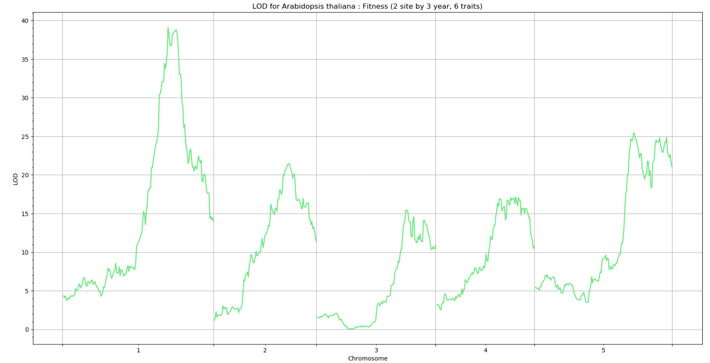

# QTL analysis

This section describes a step-by-step guide for QTL analysis.

## Input data file format

The package `FlxQTL` does not require any particular data format.  Any file readable in Julia is fine, but the input should contain traits (or phenotypes), genotype (probability), marker information on marker names, chromosomes, and marker positions, and optionally climatic information.  All inputs are types of 
Arrays in Julia and should have no missing values, i.e. imputation is required if missing values exist.

## Reading the data files and processing arrays

Use any Julia package able to read data files (`.txt`, `.csv`, etc.).  Julia's built-in module `DelimitedFiles` supports read, and write files. 
Let's try using an example dataset in `FlxQTL`. It is plant data: Arabidopsis thaliana in the `data` folder.  Detailed description on the data can be 
referred to `README` in the folder.

```julia
using DelimitedFiles

pheno = readdlm("data/Arabidopsis_fitness.csv",',';skipstart=1); # skip to read the first row (column names) to obtain a matrix only

geno = readdlm("data/Arabidopsis_genotypes.csv",',';skipstart=1); 

markerinfo = readdlm("data/Arabidopsis_markerinfo_1d.csv",',';skipstart=1);

```

For efficient computation, the normalization of matrices is necessary.  The phenotype matrix labelled as `pheno` here composes of wide range of values 
from 1.774 to 34.133, so that it is better to narow the range of values in [0,1], [-1,1], or any narrower interval for easy computation.  Note that 
the dimension of a phenotype matrix should be `the number of traits x the number of individuals`.

```julia
using Statistics, StatsBase
Y=convert(Array{Float64,2},pheno'); #convert from transposed one to a Float64 matrix
Ystd=(Y.-mean(Y,dims=2))./std(Y,dims=2); # sitewise normalization
```

In the genotype data, `1`, `2` indicate Italian, Swedish parents, respectively. You can rescale the genotypes for efficiency. 

```julia
geno[geno.==1.0].=0.0;geno[geno.==2.0].=1.0; # or can do geno[geno.==1.0].=-1.0 for only genome scan

```
For genome scan, we need restructure the standardized genotype matrix combined with marker information.  Note that the genome scan in `FlxQTL` is 
implemented by CPU parallelization, so we need to add workers (or processes) before the genome scan.  Depending on the computer CPU, one can add as many 
processes as possible. If your computer has 16 cores, then you can add 15 or little more.  Note that you need to type `@everywhere` followed by `using PackageName` for parallel computing.  The dimension of a genotype (probability) matrix should be 
`the number of markers x the number of individuals`.

```julia
using Distributed
addprocs(4) 
@everywhere using FlxQTL 
XX=FlxQTL.Markers(markerinfo[:,1],markerinfo[:,2],markerinfo[:,3],geno') # marker names, chromosomes, marker positions, genotypes

```
**Julia tip**: Whenever you reload a package, i.e. `using FlxQTL`, you should re-enter `XX=FlxQTL.Markers(markerinfo[:,1],markerinfo[:,2],markerinfo[:,3],geno')` to 
fresh the struct of array.  If not, your genome scan throw an error.  You should also do with another struct of array in a submodule `QTLplot`, `FlxQTL. layers`.

Optionally, one can generate a trait covariate matrix (Z).  The first column indicates overall mean between the two regions, and 
the second implies site difference: `-1` for Italy, and `1` for Sweden.

```@repl
Z=hcat(ones(6),vcat(-ones(3),ones(3)))
m,q = size(Z) # check the dimension
```

## Computing a genetic (or climatic) relatedness matrix

The submodule `GRM` contains functions for computing kinship matrices, `kinshipMan`, `kinship4way`, `kinshipGs`, `kinshipLin`, `kinshipCtr`, and computing 
3D array of kinship matrices for LOCO (Leave One Chromosome Out) with a shrinkage method for nonpositive definiteness, 
`shrinkg`, `shrinkgLoco`, `kinshipLoco`.  
Note that the shrinkage option is only used for `kinshipMan`, `kinship4way`.

For the Arabidopsis genotype data, we will use a genetic relatedness matrix using manhattan distance measure, `kinshipMan` with a shrinkage with 
the LOCO option.

```julia
Kg = FlxQTL.shrinkgLoco(FlxQTL.kinshipMan,10,XX)
```
For no LOCO option with shrinkage,

```julia
K = FlxQTL.shrinkg(FlxQTL.kinshipMan,10,XX.X)
```


If you have climatic information on your trait data, you can compute the relatedness matrix using one of the above functions, but it is recommended using 
`kinshipGs`,`kinshipLin`,`kinshipCtr` after normalization.  Since the climatic information is not available, we use an identity matrix.

```@repl
using LinearAlgebra
Kc = Matrix(1.0I,6,6) # 3 years x 2 sites
```

## 1D genome scan

Once all input matrices are ready, we need to proceed the eigen-decomposition to two relatedness matrices. 
For a non-identity climatic relatedness, and a kinship with LOCO, you can do eigen-decomposition simultaneously.  Since we use the identity climatic 
relatedness, you can use `Matrix(1.0I,6,6)` for a matrix of eigenvectors and `ones(6)` for a vector of eigenvalues.

```julia
Tg,Λg,Tc,λc = FlxQTL.K2Eig(Kg,Kc,true); # the last argument: LOCO::Bool = false (default)

Tg,λg = FlxQTL.K2eig(Kg, true) # for eigen decomposition to one kinship with LOCO
```

For eigen decomposition to one kinship with no LOCO option,

```julia
Tg,λg = FlxQTL.K2eig(Kg)
```
Now start with 1D genome scan with (or without) LOCO including `Z` or not.  
For the genome scan with LOCO including `Z`, 

```julia
LODs,B,est0 = FlxQTL.geneScan(1,Tg,Tc,Λg,λc,Ystd,XX,Z,true); # FlxQTL for including Z (trait covariates) or Z=I
```
For the genome scan with LOCO excluding `Z`, i.e. an identity matrix, we have two options: a FlxQTL model and a conventional MLMM 
```julia
LODs,B,est0 = FlxQTL.geneScan(1,Tg,Tc,Λg,λc,Ystd,XX,true); # FlxQTL for Z=I 

LODs,B,est0 =FlxQTL.geneScan(1,Tg,Λg,Ystd,XX,true); # MLMM
```
Note that the first argument in `geneScan` is `cross::Int64`, which indicates a type of genotype or genotype probability.  For instance, if you use a 
genotype matrix whose entry is one of 0,1,2, type `1`. If you use genotype probability matrices, depending on the number of alleles or genotypes in a marker, one can type the corresponding number. i.e. `4-way cross: 4`, `HS DO mouse: 8 for alleles, 32 for genotypes`, etc.   

For no LOCO option,

```julia
LODs,B,est0 = FlxQTL.geneScan(1,Tg,Tc,Λg,λc,Ystd,XX,Z);

LODs,B,est0 = FlxQTL.geneScan(1,Tg,Tc,Λg,λc,Ystd,XX);

LODs,B,est0 =FlxQTL.geneScan(1,Tg,Λg,Ystd,XX); # MLMM
```
The function `geneScan` has three arguments: `LOD scores (LODs)`, `effects matrix under H1 (B)`, and `parameter estimates under H0 (est0)`, which 
is an `Array{Any,1}`.  If you want to see null parameter esitmate in chromosome 1 for LOCO option, type `est0[1].B`, `est0[1].loglik`, `est0[1].τ2`, 
`est0[1].Σ`.   
In particular, you can extract values from each matrix in `B` (3D array of matrices) to generate an effects plot. To print an effect size matrix for the 
third marker, type `B[:,:,3]`.


## Generating plots

To produce a plot (or plots) for LOD scores or effects, you need first a struct of arrays, `layers` consisting of chromosomes, marker positions, 
LOD scores (or effects), which should be `Array{Float64,2}`.  You can then generate one genome scan result or multiple genenome scan results on one plot.  Note that the color is randomly selected to generate a plot.   
The function `plot1d` has more keyword argument options: `yint=[]` for a vector of y-intercept(s), `yint_color=["red"]` for a vector of y-intercept 
color(s), `Legend=[]` for multiple graphs, `loc="upper right"` for the location of `Legend`, etc.

```julia
Arab_lod = FlxQTL.layers(markerinfo[:,2],markerinfo[:,3],LODs[:,:]) # LODs is a vector here, so force it to be a matrix
plot1d(Arab_lod;title= "LOD for Arabidopsis thaliana : Fitness (2 site by 3 year, 6 traits)",ylabel="LOD")
```



## Performing a permutation test

Since the statistical inference for `FlxQTL` relies on LOD scores and LOD scores, the function `permTest` finds thresholds for a type I error.  The first 
argument is `nperm::Int64` to set the number of permutations for the test. For `Z = I`, type `Matrix(1.0I,6,6)` for the Arabidopsis thaliana data.  In the keyword argument, `pval=[0.05 0.01]` is default to get thresholds of `type I error rates (α)`.

```julia
julia> maxLODs, H1par_perm, cutoff = FlxQTL.permTest(1000,1,Kg,Kc,Ystd,XX,Z;pval=[0.05]) # cutoff at 5 %
```
