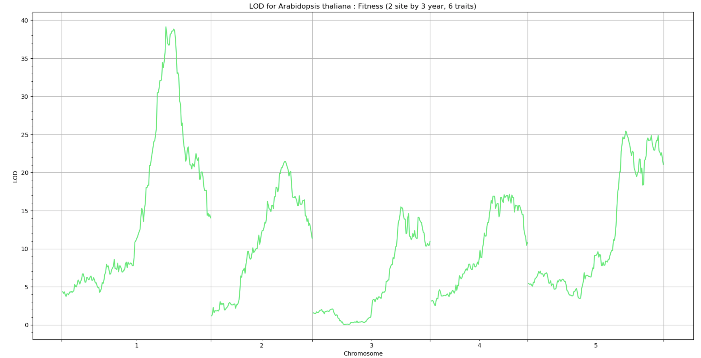

# QTL analysis

This section describes a step-by-step instruction for QTL analysis.

## Input data file format

The package `FlxQTL` does not require any particular data format.  Any file readable in Julia is fine, but the input should contain traits (or phenotypes), genotypes (or genotype/allele 
probabilities), marker information on marker names, chromosomes, and marker positions.  All inputs are types of Arrays (Float64), or Matrix{Float64}, in Julia and should have no missing values, i.e. imputation is required if missing values exist.

## Reading data files and processing arrays

Use any Julia package able to read data files (`.txt`, `.csv`, etc.). 
We start with a plant dataset in `FlxQTL`: Arabidopsis thaliana in the `data` folder.  Detailed description on the data can be 
referred to `README` in the folder.


```julia
using DelimitedFiles

pheno = readdlm("data/Arabidopsis_fitness.csv",',';skipstart=1); # skip to read the first row (column names) to obtain a matrix only

geno = readdlm("data/Arabidopsis_genotypes.csv",',';skipstart=1); 

markerinfo = readdlm("data/Arabidopsis_markerinfo_1d.csv",',';skipstart=1);
```

For efficient computation, the normalization of matrices is necessary.  `pheno` is a real-valued matrix from 1.774 to 34.133, so that it is better to narow the range in [0,1], [-1,1], or any narrower interval for efficient computation.  Note that 
the dimension of a phenotype matrix should be `the number of traits (or phenotypes) x the number of individuals`, i.e. `m x n`.


```julia
using Statistics, StatsBase
Y=convert(Array{Float64,2},pheno'); #convert from transposed one to a Float64 matrix
Ystd=(Y.-mean(Y,dims=2))./std(Y,dims=2); # sitewise normalization
```

!!! Note
- If the data are skewed or have outliers, simple standadization may not correct them.  You may use a `Y_huber()` function to rescale the data to be less sensitve to skewness or outliers.

In the genotype data, `1`, `2` indicate Italian, Swedish parents, respectively. You can rescale the genotypes for efficiency or interpretability. 


```julia
geno[geno.==1.0].=0.0;geno[geno.==2.0].=1.0; # or can do geno[geno.==1.0].=-1.0 for only genome scan
```

For genome scan, we need restructure the standardized genotype matrix combined with marker information.  Note that the genome scan in `FlxQTL` is 
implemented by CPU parallelization, so we need to add workers (or processes) before the scan starts.  Depending on the computer CPU, one can add as many 
processes as possible. If your computer has 16 cores, then you can add 15 or little more.  Note that you need to type `@everywhere` followed by `using PackageName` to dispatch the package availabe to all workers for parallel computing.  The dimension of a genotype (probability) matrix should be `the number of markers x the number of individuals`, i.e. `p x n`.


```julia
using Distributed
addprocs(4) 
@everywhere using FlxQTL 
XX=Markers(markerinfo[:,1],markerinfo[:,2],markerinfo[:,3],geno') # marker names, chromosomes, marker positions, genotypes
```

Optionally, one can generate a trait covariate matrix (Z).  The first column indicates overall mean between the two regions, and 
the second implies site difference: `-1` for Italy, and `1` for Sweden.


```julia
Z=hcat(ones(6),vcat(-ones(3),ones(3)))
m,q = size(Z) # check the dimension
```

## Computing a genetic relatedness matrix (GRM) 

The submodule `GRM` contains functions for computing kinship matrices, `kinshipMan`, `kinship4way`, `kinshipLin`, `kinshipCtr`, and computing a 
3D array of kinship matrices for LOCO (Leave One Chromosome Out) with a shrinkage method for nonpositive definiteness, 
`shrinkg`, `shrinkgLoco`, `kinshipLoco`.  
Note that the shrinkage option is only used for `kinshipMan`, `kinship4way`.


For the Arabidopsis genotype data, we will use a genetic relatedness matrix using manhattan distance measure, `kinshipMan` with a shrinkage with 
the LOCO option.


```julia
Kg = shrinkgLoco(kinshipMan,10,XX) # a 3-d array 
```

For no LOCO option with shrinkage,


```julia
K = shrinkg(kinshipMan,10,XX.X) # a matrix
```


## 1D genome scan

FlxQTL has added a new functionality for higher dimensional traits, operated by penalized log-likelihood function using `Prior` with `df_prior` for an error term, ``\Sigma``, distributed by Inverse-Wishart distribution to remedy numerial stability.  Users can choose a penalization option in the keyword argument, `penalize =true` when scan or permutation fails convergence in the default setting (no penalization).  The default positive definite scale matrix is then a large scaled matrix (`Prior = cov(Y,dims=2)*3`).  We recommend controlling degrees of freedom (`df_prior`), i.e. ``m+1 (default) \le df\_prior < 2m ``, or updating the null parameter estimates (`H0_up = true`) for numerical stability when analyzing higher dimenional traits with genotype probability data if any singularity error occurrs.   

!!! Note 
- The last resort of `df_prior = Int64(ceil(1.9m))` could be applied unless any of adjustments would work. Any tolerance (`itol`, `tol0`, `tol`) of base algorithms may be adjusted, but this is not needed in most cases.


Once all input matrices are ready, we need to proceed the eigen-decomposition to a relatedness matrix: the sigular value decomposition is implemented.

```julia
Tg,λg = K2eig(Kg, true) # for eigen decomposition to one kinship with LOCO
```

For eigen decomposition to one kinship with no LOCO option,


```julia
T,λ = K2eig(K) # no LOCO
```

Now start with 1D genome scan with (or without) LOCO including `Z` or not.  
For the genome scan with LOCO including `Z`, 


```julia
LODs,B,est0 = gene1Scan(1,Tg,Λg,Ystd,XXa,true;Z=Z); # FlxQTL for including Z (trait covariates)
```

For the genome scan with LOCO without a particular form of `Z`, i.e. an identity matrix (default), we have two options: a FlxQTL model and a conventional MLMM (slower).  Both have penalization options.


```julia
LODs,B,est0 = gene1Scan(1,Tg,Λg,Ystd,XX,true); # FlxQTL for Z=I 

LODs,B,est0 = gene1Scan(1,Tg,Λg,Ystd,XX,true;penalize=true); # penalization option for Z=I 

lods,b,Est0 = gene1Scan(Tg,Λg,Ystd,XX,1,true); # MLMM
```

Or one can return ``\log_{10}P`` instead of LOD scores using `logP = true` in the keyword argument for all the `gene1Scan()` functions.

```julia

lnP, B, est0 = gene1Scan(1,Tg,Λg,Ystd,XX,true;logP=true); 
```


Note that the argument `cross::Int64` in `gene1Scan` indicates a type of genotype or genotype probability.  For instance, if you use a 
genotype matrix whose entry is one of 0,1,or 2, type `1`. If you use genotype probability matrices, depending on the number of alleles or genotypes in a marker, one can type the corresponding number. i.e. `4-way cross: 4`, `HS DO mouse: 8 for alleles, 32 for genotypes`, etc.  

For no LOCO option (default), the last positioal argument can be omitted for the default value.

```julia
LOD,B1,est00 = gene1Scan(1,T,λ,Ystd,XX;Z=Z);

LOD,B1,est00 = gene1Scan(1,T,λ,Ystd,XX); # Z=I 

lod,b1,Est00 = gene1Scan(T,λ,Ystd,1,XX); # MLMM
```

The function `gene1Scan()` has three outputs: `LOD scores (LODs)`, `effects matrix under H1 (B)`, and `parameter estimates under H0 (est0)`, which 
is an `Array{Any,1}`.  If you want to see null parameter esitmate in chromosome 1 for LOCO option, for instance, type `est0[1].B`, `est0[1].loglik`, `est0[1].Vc`, 
`est0[1].Σ`, which is a struct of `Result`.  When analyzing high-dimensional traits with genotype probability data, e.g. `m = 36` with `cross = 4` without no penalization, this may fail completing genome scan; it is recommended that setting `H0_up=true` and `penalize=true`, which updates the null variance component ``V_C`` by ``\tau^2`` under `H0`, i.e., ``\Omega \approx \tau^2V_C``, followed by the addtional update ``\tau^2`` for each marker. 
In particular, you can extract values from each matrix in `B` (3D array of matrices) to generate an effects plot. To print an effect size matrix for the 
third marker, type `B[:,:,3]`, where the last dimension is the order of a marker in the genotype (probability) data.


## Generating plots


The `QTLplot` module is currently unavailable but plotting functions will be replaced with [BigRiverQTLPlots.jl](https://github.com/senresearch/BigRiverQTLPlots.jl) soon.




## Performing a permutation test

Since the statistical inference for `FlxQTL` relies on LOD scores, we have now added three kinds of permutation test functions to estimate 
thresholds for a type I error: `mlmmTest()`, `permTest()`, and `permutationTest()`.    `mlmmTest()` implements permutation test with no LOCO for MLMM models with a penalization option, `permTest()` estimates null parameters without LOCO first, followed by scan with permuted data with LOCO and penalization, and the third function has options of both penalization and LOCO.  `permutationTest()` can estimate null parameters from the actual data with LOCO, followed by LOCO scan with permuted data to obtain the distribution of maximum LOD scores when both options are on.  Thus, both options may be much longer than the first two but may yield better estimation.  Note that penalization is not neccessary for lower dimensional traits.

The first argument is `nperm::Int64` to set the number of permutations for the test.  For keyword arguments, `pval=[0.05 0.01]` is default to get thresholds of `type I error rates (α)`, and the identity matrix, i.e. `Z=diagm(ones(m))` is default. 


```julia
maxLODs, H1par_perm, cutoff = permTest(1000,1,Kg,Ystd,XX;Z=Z,pval=[0.05]) # LOCO & penalization, cutoff at 5 %

maxlods, H1par_perm1, cutoff1 = mlmmTest(1000,1,K,Ystd,XX,true;pval=[0.05])  # no LOCO & penalization for MLMM 

Maxlods, H1par_loco, cutoff2 = permutationTest(1000,1,Kg,Ystd,XX,true,true;Z=Z) # LOCO + penalization

```


## 2D genome scan

A `gene2Scan()` function has two options just as `gene1Scan` functions; LOCO and penalization for both FlxQTL and MLMM models.  Note that one needs a much coarser genotype (probability) matrix than that for 1D scan since the distance between any two markers in a chromosome is very close each other, often yielding a numerical error during the operation.  This gets worse when the conversional MLMM is chosen to implement.    
The provided data for 2D scan can be processed by the [R/qtl](https://cran.r-project.org/web/packages/qtl/qtl.pdf) library with a `sim.geno` function by picking one of the simulated data sets, where `step=5` and `draws=16` are set for this Arabidopsis data.

```julia
geno_2d = readdlm("data/Arabidopsis_genotypes_2d.csv",',';skipstart=1); 

markerinfo_2d = readdlm("data/Arabidopsis_markerinfo_2d.csv",',';skipstart=1);

geno_2d[geno_2d.==1.0].=0.0;geno_2d[geno_2d.==2.0].=1.0; # or can do geno_2d[geno_2d.==1.0].=-1.0 for only genome scan

X2=Markers(markerinfo_2d[:,1],markerinfo_2d[:,2],markerinfo_2d[:,3],geno_2d) # marker names, 

LOD_2d,B2,est02 = gene2Scan(1,Tg,Λg,Ystd,X2,true);  # for Z=I included as default in keyword arguments

LOD2d,B02,est2 = gene2Scan(1,Tg,Λg,Ystd,X2,true;Z=Z,penalize=true) # for contrast Z & penalization option


lod_2d,b2,Est02 = gene2Scan(Tg,Λg,Ystd,X2,1,true) # MLMM

```

Or one can do with no LOCO as explained as in aforementioned 1D genome scan.
